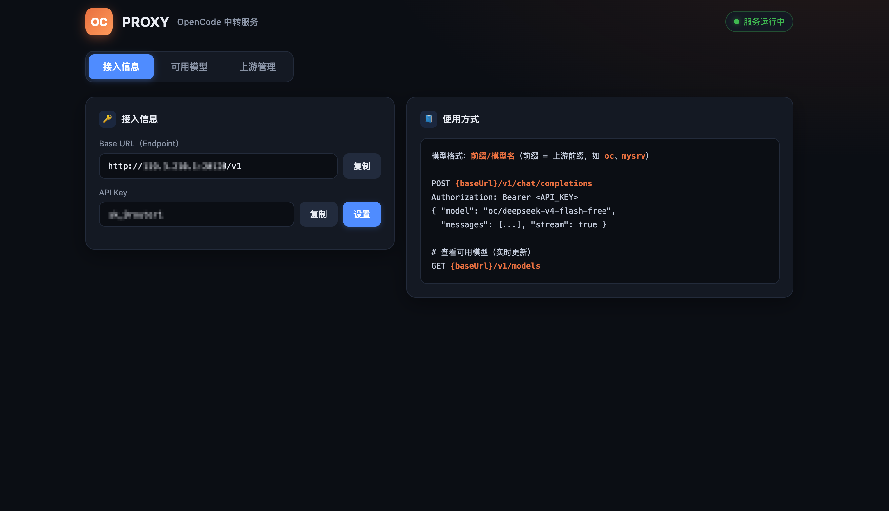
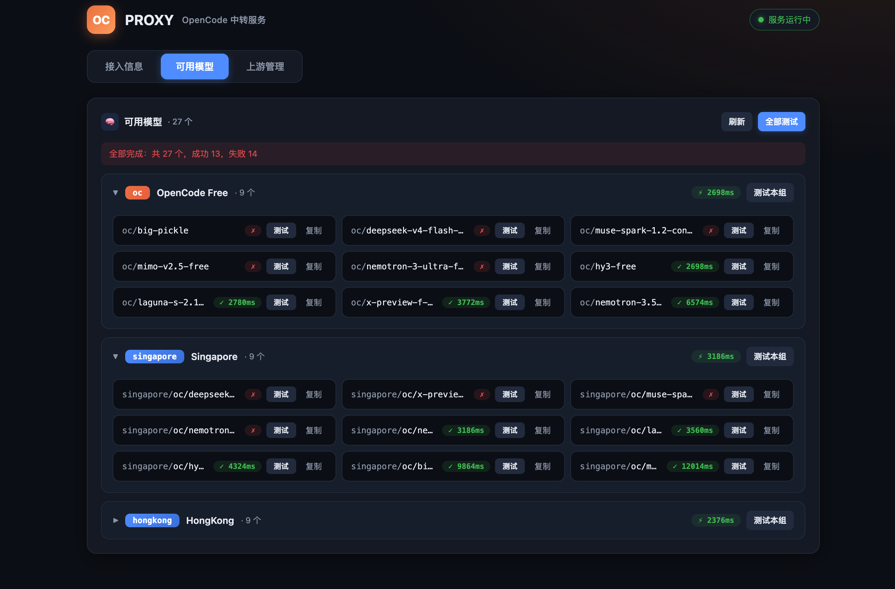
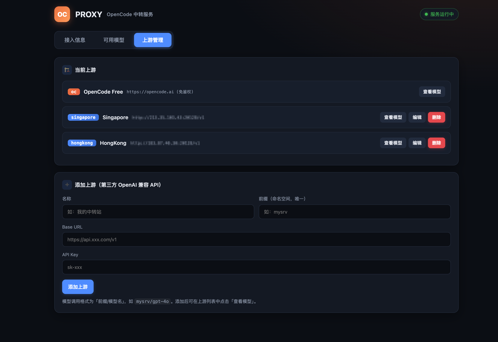

# OC-PROXY

精简的 **AI 上游中转服务**。支持两种上游：

1. **内置 OpenCode Free**（免鉴权直通 `opencode.ai`）
2. **自定义 OpenAI 兼容 API**（网页可视化添加第三方中转站/OpenRouter/国内中转等，用自己的 baseUrl + apiKey）

对外暴露统一 **OpenAI 兼容接口**，本地用 **baseURL + API Key + model** 即可调用，`/v1/models` **实时拉取**所有上游最新模型并缓存。

## 核心特性

- `POST /v1/chat/completions` —— 按模型前缀路由到对应上游（支持流式 SSE 透传）
- `GET /v1/models` —— 实时拉取 + 缓存的所有上游模型
- `GET /` —— 前端页面：复制 Base URL / API Key / 模型列表 + 上游管理
- **前缀命名空间**：每个上游一个前缀，如 `oc/deepseek-v4-flash-free`、`mysrv/gpt-4o`，避免重名
- 网页可视化添加上游（填名称、前缀、baseUrl、apiKey），JSON 持久化，支持编辑与删除
- **网页自定义 API Key**：在「接入信息」页点「设置」即可更换对外 API Key（持久化到 `data/settings.json`，旧 Key 立即失效，需携带新 Key 鉴权）
- **模型连通性测试**：支持单个模型测试、「测试本组」（按上游/前缀分组批量测试）和「全部测试」；测试结果徽章直接显示在每行模型右侧（失败时 hover 叉号可查看详情）
- **按速度排序**：可用模型按组折叠展示，组内已测试模型按延迟升序排列（最快在上），组头显示该组最低延迟

## 界面截图

| 接入信息 | 可用模型 | 上游管理 |
| :---: | :---: | :---: |
|  |  |  |

## 快速开始（Docker）

### 1. 部署到服务器

```bash
cd oc-proxy

# 先修改 docker-compose.yml 里的 API_KEY 为强密码
vim docker-compose.yml

docker compose up -d --build
```

服务启动后：

- 前端页面：`http://<服务器IP>:20128/`
- API 接口：`http://<服务器IP>:20128/v1`

### 2. 本机使用

在「接入信息」页复制 **Base URL** 和 **API Key**，然后在任意支持 OpenAI 兼容接口的工具中配置：

```
Base URL:  http://<服务器IP>:20128/v1
API Key:   sk_你的key
Model:     oc/deepseek-v4-flash-free   （模型带前缀，在页面实时查看）
```

命令行验证：

```bash
curl http://<服务器IP>:20128/v1/chat/completions \
  -H "Authorization: Bearer sk_你的key" \
  -H "Content-Type: application/json" \
  -d '{
    "model": "oc/mimo-v2.5-free",
    "messages": [{"role":"user","content":"你好"}],
    "stream": true
  }'
```

查看可用模型（实时）：

```bash
curl http://<服务器IP>:20128/v1/models -H "Authorization: Bearer sk_你的key"
```

### 3. 添加自定义上游（中转别人的 API）

打开前端页面 → **上游管理** tab → 填表：

| 字段 | 说明 | 示例 |
| --- | --- | --- |
| 名称 | 给上游起个名字 | 我的中转站 |
| 前缀 | 命名空间（唯一，调用时用） | mysrv |
| Base URL | 上游地址 | `https://api.xxx.com/v1` |
| API Key | 上游给你的 key | sk-xxx |
| Models URL | 模型列表地址（可选，默认 `{baseUrl}/v1/models`） | 留空 |

添加后，模型列表会多出 `mysrv/...` 前缀的模型，调用方式：`mysrv/gpt-4o`。

在**上游管理**列表中可对每个自定义上游执行：
- **查看模型**：展开查看该上游的模型列表
- **编辑**：修改名称、前缀、Base URL、API Key（改前缀后需用新的「前缀/模型名」调用）
- **删除**：移除该上游

自定义上游配置存于 `data/upstreams.json`（Docker 卷持久化）。

对应的 API：
- `GET /api/upstreams` —— 列出所有自定义上游
- `POST /api/upstreams` —— 新增上游
- `PUT /api/upstreams/:id` —— 更新上游（部分字段可省略）
- `DELETE /api/upstreams/:id` —— 删除上游

## 本机直接运行（无 Docker）

```bash
cd oc-proxy
npm install
npm start
# 默认 http://localhost:20128
```

## 环境变量

| 变量 | 默认 | 说明 |
| --- | --- | --- |
| `PORT` | `20128` | 监听端口 |
| `HOSTNAME` | `0.0.0.0` | 绑定地址 |
| `API_KEY` | `sk_9router` | 对外 API Key 初始值（前端展示 / 客户端调用需带）。部署后可在网页「接入信息」页点「设置」动态修改并持久化 |
| `ALLOW_PUBLIC_API` | `false` | 设为 `true` 跳过鉴权（仅内网调试，不建议公网） |
| `DATA_DIR` | `./data` | 上游配置存储目录 |
| `MODEL_CACHE_TTL_MS` | `600000` | 模型缓存时长（10 分钟） |

## 目录结构

```
oc-proxy/
├── server.js            # Express 入口：鉴权 + 路由 + 上游管理 API
├── lib/
│   ├── upstreams.js     # 上游管理（内置 opencode + 自定义，JSON 持久化）
│   ├── settings.js      # 运行时设置管理（网页自定义 API Key 持久化）
│   ├── models.js        # 多上游模型实时拉取 + 缓存 + 前缀合并
│   └── proxy.js         # /v1/chat/completions 按前缀路由直通反代
├── public/
│   └── index.html       # 前端：复制 apikey/baseurl + 上游管理
├── docs/
│   └── screenshots/     # 界面截图（README 展示）
├── data/                # 上游配置持久化目录
├── Dockerfile
├── docker-compose.yml
└── package.json
```

## 说明

- **内置 opencode** 前缀固定为 `oc`，只展示免费模型（id 以 `-free` 结尾或命中白名单如 `big-pickle`）。
- 自定义上游模型**保留原名**，带前缀调用（如 `mysrv/gpt-4o`），无免费过滤。
- 模型列表缓存 10 分钟（可配 `MODEL_CACHE_TTL_MS`）。
- 服务仅做**直通转发**，不记录请求内容，不落盘聊天数据（仅持久化上游配置与运行时设置）。
- 网页修改 API Key 后，旧 Key 立即失效，新 Key 持久化于 `data/settings.json`（Docker 卷持久化）；若 `settings.json` 不存在则回退到环境变量 `API_KEY` 或默认值。
